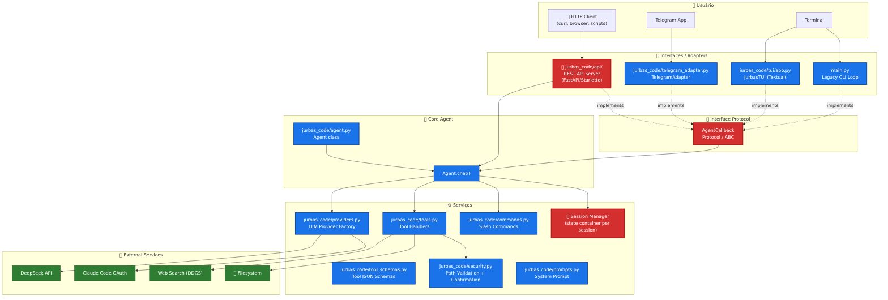

# Jurbas-Code Architecture

This document describes the modular architecture of Jurbas-Code. The project is strictly organized into a single `jurbas_code/` package. The legacy `jurbas/` namespace is deprecated and must not be reintroduced.

## Diagrama

## Module Boundaries

### `main.py` (CLI Entrypoint)
- Thin wrapper for the application.
- Loads environment variables (`dotenv`).
- Handles top-level exceptions and user interrupts.
- Builds the client and runs the `Agent` from `jurbas_code.agent`.
- **Guardrail**: Keep it thin. Core behavior belongs in the `jurbas_code/` package.

### `jurbas_code.agent` (Agent Loop)
- Manages the core conversation loop between the user and the LLM.
- Handles provider selection, system prompt loading, and session history.
- Manages token accounting and tool execution flow.

### `jurbas_code.providers` (LLM Providers & Adapters)
- Contains logic for authenticating and initializing LLM clients.
- Currently supports `claude` (via Claude Code auth) and `deepseek` via API key.
- Resolves the provider model (`_env_model`, `resolve_provider_model`).
- Translates messages and tool definitions between OpenAI/DeepSeek and Anthropic formats.

### `jurbas_code.tools` (Tool Handlers)
- Implements the available tool set (filesystem read/write, bash execution, web search).
- Maps tool names to their implementation handlers in `TOOL_HANDLERS`.

### `jurbas_code.tool_schemas` (Tool Schemas)
- Contains the canonical JSON schema (`tools`) for the tool definitions sent to the model.

### `jurbas_code.security` (Security & Guardrails)
- Implements path validation (`safe_path`) to prevent directory traversal.
- Defines dangerous command patterns and read-only command lists (`_is_dangerous`, `_is_readonly_bash`).
- Manages user confirmation prompts for mutating shell actions.

### `jurbas_code.prompts` (System Prompts)
- Centralizes the `SYSTEM_PROMPT` used to define agent behavior.

## Architecture Guardrails

Future contributions must respect these boundaries:
- **No Parallel Packages**: Do not reintroduce a parallel `jurbas/` package. All runtime code lives in `jurbas_code/`.
- **No Direct Imports from `main.py`**: Other modules should not import from the CLI entrypoint.
- **Provider Independence**: Adapters should handle model-specific quirks, keeping the agent loop generic where possible.
- **Security First**: All new tools that touch the filesystem or execute commands MUST use `jurbas_code.security` for validation.
- **No Startup Side Effects**: Do not add runtime side effects on import or normal startup (e.g., repository analysis, migrations, object extraction).
